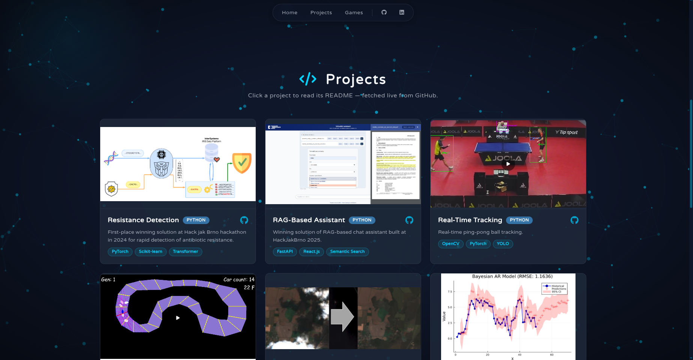
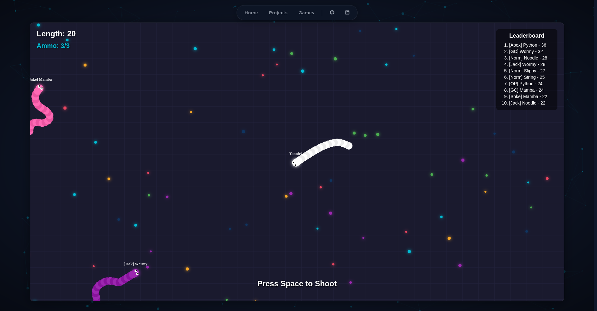

# Portfolio

Minimal portfolio with dynamic `README.md` loading. Supports subapps like snake game.

Link: https://yannickgibson.github.io/

## Features

- **Animated Hero:** The landing page features a typewriter effect that cycles through roles and skills, powered by Typed.js.
- **Flowing Particles:** A smooth, interactive particle background adds depth and motion to the site.
- **Dynamic README Loading:** Project tiles fetch and display their latest README directly from GitHub, rendered with syntax highlighting and KaTeX support.
- **Subapps Player:** Games and interactive demos (like Snake) run in a dedicated player view, launched seamlessly from the main site.

## Previews

### Landing Page

### Projects

### Subapps Player

